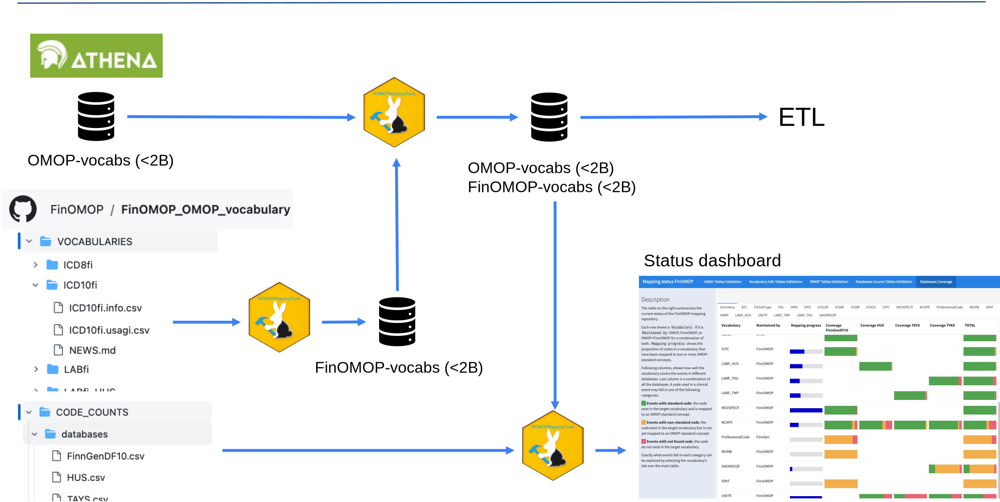

# ROMOPMappingTools

<!-- badges: start -->
<!-- badges: end -->

ROMOPMappingTools provides the functions needed to maintain a repository with mappings of local medical vocabularies to OMOP standard vocabularies. 

It allows to : 

- Transform multiple mapping files in usagi-extended format to the OMOP vocabulary tables
- Append created OMOP vocabulary tables to OMOP vocabulary tables downloaded from Athena
- Run QC on the input an output files
- Given the code's frequency from one or more local databases calculates how well a OMOP vocabulary covers the medical events
- Create a interactive dashboard to show the above results

[See vignettes for details](https://finomop.github.io/ROMOPMappingTools/π). 

## Example of a mapping repository

This package contains only the functions to process the input files. 
How the files and repository are organized is independent of this package. 

As an example we show an demo version of the repo and folder structure we use for maintaining the mapping files in FinOMOP:
[FinOMOP_OMOP_vocabulary_test](https://github.com/FinOMOP/FinOMOP_OMOP_vocabulary_test). Check also the documentation part: [FinOMOP_OMOP_vocabulary_test/DOCUMENTATION](https://github.com/FinOMOP/FinOMOP_OMOP_vocabulary_test/blob/development/DOCUMENTATION/README.md)

Following diagram summarizes how FinOMOP uses ROMOPMappingTools to maintaining their mappings: 

1. A `VOCABULARIES` folder contains a subfolder for each local vocabulary with a `usagi.csv` and an `info.csv` mapping files, as well as a configuration file.
2. ROMOPMappingTools validate correctness of the mapping files and transform them into OMOP vocabulary tables. Local codes receive concept_ids over the 2 billion. 
3.  ROMOPMappingTools appends the newly created OMOP vocabulary tables to the OMOP vocabulary tables downloaded from Athena. 
4.  Merged local and international OMOP vocabulary tables can be directly input into the ETL. 
5.  Additionally, the repository has a `CODE_COUNTS` folder with code counts from multiple databases and configuration files. 
6.  ROMOPMappingTools validate correctness of the code count files and use these to assess how well the new OMOP vocabulary covers the events in each database. 
7.  ROMOPMappingTools creates a `Status dashboard` that summarizes the results, and publish it as [Github page](https://finomop.github.io/FinOMOP_OMOP_vocabulary_test/StatusReport/dashboard.html).  

